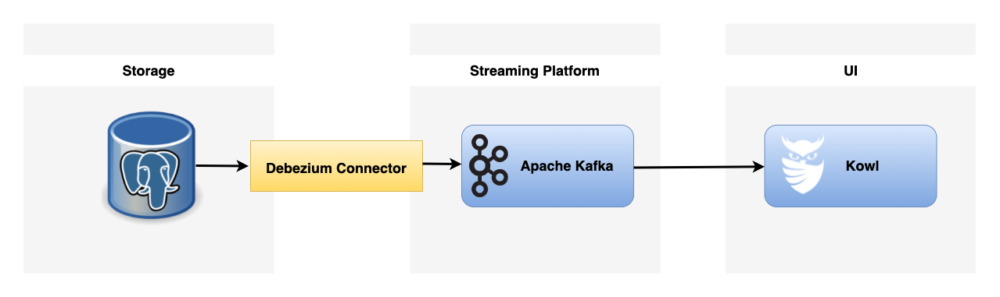
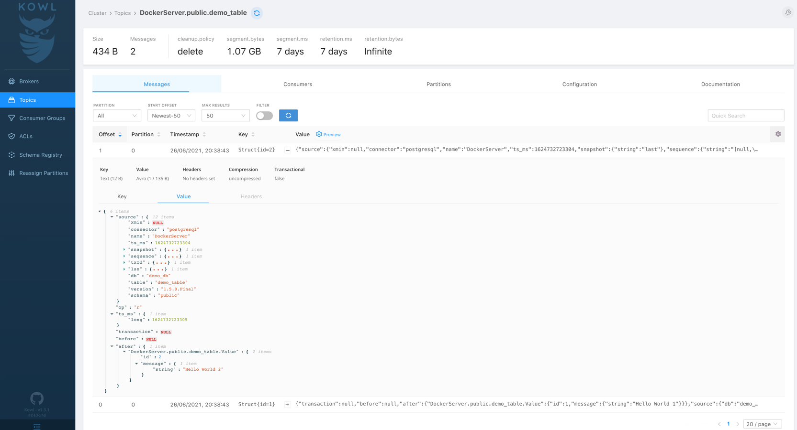

# Change Data Capture with Debezium & PostgreSQL (demo)

This repository contains the demo Docker Compose ([docker-compose.yml](./docker/docker-compose.yml)) file for setting up and
running the whole CDC infrastructure (Kafka Connect, Debezium, PostgreSQL etc.)

## What is Change Data Capture?

> Change Data Capture, or CDC, is an older term for a system that monitors and captures the changes in data so that other
> software can respond to those changes. Data warehouses often had built-in CDC support, since data warehouses need to
> stay up-to-date as the data changed in the upstream OLTP databases.
>
> -- <cite>https://debezium.io/documentation/faq/#what_is_change_data_capture</cite>

### Architecture Overview



The following components are available when you run the whole infrastructure:

* [Apache Kafka](https://kafka.apache.org/)
* [Zookeeper](https://zookeeper.apache.org/)
* [Kafka Connect](https://kafka.apache.org/documentation/#connect)
* [Schema Registry](https://docs.confluent.io/platform/current/schema-registry/index.html)
* [Kowl UI](https://github.com/cloudhut/kowl)
* [Kafka Connect UI](https://github.com/lensesio/kafka-connect-ui)
* [PostgreSQL](https://www.postgresql.org/)
* [Adminer](https://www.adminer.org/)

## Getting Started

### Prerequisites

* Docker

### Usage

#### 1. Start Docker containers

```shell
cd docker
docker compose up -d
```

#### 2. Check if all components are up and running

```shell
docker compose ps

# NAME                SERVICE             STATUS               PORTS
# adminer             adminer             running              0.0.0.0:7775->8080/tcp, :::7775->8080/tcp
# kafka               kafka               running              0.0.0.0:9092->9092/tcp, :::9092->9092/tcp, 0.0.0.0:9101->9101/tcp, :::9101->9101/tcp
# kafka-connect       kafka-connect       running (starting)   0.0.0.0:8083->8083/tcp, :::8083->8083/tcp, 9092/tcp
# kafka-connect-ui    kafka-connect-ui    running              0.0.0.0:8000->8000/tcp, :::8000->8000/tcp
# kowl                kowl                running              0.0.0.0:8080->8080/tcp, :::8080->8080/tcp
# postgres            postgres            running              0.0.0.0:5432->5432/tcp, :::5432->5432/tcp, 0.0.0.0:6532->6532/tcp, :::6532->6532/tcp
# schema-registry     schema-registry     running              0.0.0.0:8081->8081/tcp, :::8081->8081/tcp
# zookeeper           zookeeper           running              0.0.0.0:2181->2181/tcp, :::2181->2181/tcp, 2888/tcp, 3888/tcp
```

#### 3. Verify that Debezium Source connector is successfully deployed

Run below command or open your web browser and go to Kafka Connect UI [page](http://localhost:8000/#/cluster/dev) to
verify cdc connector status.

```shell
curl http://localhost:8083/connectors/postgres-cdc-demo | jq

# {
#   "name": "postgres-cdc-demo",
#   "config": {
#     "connector.class": "io.debezium.connector.postgresql.PostgresConnector",
#     "database.user": "postgres",
#     "database.dbname": "demo_db",
#     "database.hostname": "postgres",
#     "tasks.max": "1",
#     "database.password": "postgres",
#     "name": "postgres-cdc-demo",
#     "database.server.name": "DockerServer",
#     "database.port": "5432"
#   },
#   "tasks": [
#     {
#       "connector": "postgres-cdc-demo",
#       "task": 0
#     }
#   ],
#   "type": "source"
# }
```

*** *Docker Compose file contains a setup that will automatically install a Kafka Connect
plugin (`debezium/debezium-connector-postgresql`) and deploy Source Connector(`postgres-cdc-demo`).*

#### 4. View exported data from PostgreSQL

Open your web browser and go to [Kowl UI](http://localhost:8080/) then check the content
of `DockerServer.public.demo_table` topic.



#### 5. Insert more data to PostgreSQL

Run the following command to insert more data.

```shell
docker-compose exec postgres bash -c "export PGPASSWORD='postgres'; psql -h 'postgres' -U 'postgres' -d 'demo_db'"

INSERT INTO demo_table(id, message) VALUES (3, 'Hello World 3');
INSERT INTO demo_table(id, message) VALUES (4, 'Hello World 4');
```

#### 6. Destroy demo infrastructure

When you're done, stop Docker containers by running.

```shell
docker compose down -v
```

## Important Endpoints

| Name | Endpoint | 
| -------------:|:--------:|
| `Kafka Connect` | [http://localhost:8088/](http://localhost:8088/) |
| `Kafka Connect UI` | [http://localhost:8000/](http://localhost:8000/) |
| `Kowl UI` | [http://localhost:8080/](http://localhost:8080/) |
| `Adminer - Demo Table view (username: cdcdemo, password: cdcdemo)` | [http://localhost:7775/?pgsql=postgres&username=cdcdemo&db=demo_db&ns=public&select=demo_table](http://localhost:7775/?pgsql=postgres&username=cdcdemo&db=demo_db&ns=public&select=demo_table) |
| `Schema-registry` | [http://localhost:8081/](http://localhost:8081/) |

## References

* [Kafka Docker Images](https://github.com/confluentinc/kafka-images)
* [Debezium connector for PostgreSQL](https://debezium.io/documentation/reference/connectors/postgresql.html)
* [Debezium docker images - PostgreSQL](https://github.com/debezium/docker-images/tree/master/postgres/13)
* [Confluent Hub](https://www.confluent.io/hub/)
* [PostgreSQL](https://www.postgresql.org/)
* [Adminer](https://www.adminer.org/)
* [Kafka Connect UI](https://github.com/lensesio/kafka-connect-ui)
* [cloudhut/kowl](https://github.com/cloudhut/kowl)

## License

Distributed under the MIT License. See `LICENSE` for more information.
